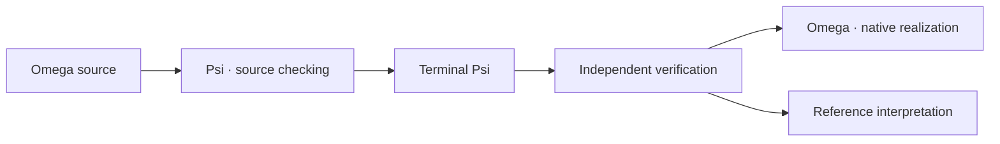

# Omega

A systems language built around explicit state machines, checked contracts,
and ownership of memory and resources.

**Experimental.** The Rust compiler is under active development. The language
design is ahead of its implementation; native support is still being completed.

[Language guide](wiki/language_guide/language_guide.md) ·
[Specification](wiki/README.md#current-specification-subjects) ·
[Examples](samples/) ·
[Contributing](#development)

## What it looks like

A language example: removing items from stock without unsigned underflow.

```omega
data Stock {
    available: u32;
}

machine Stock::take(&mut self, count: u32)
requires count <= self.available
ensures self.available == before(self.available) - count
{
    self.available = self.available - count;
}
```

- **`requires`**: the caller establishes that enough stock exists—perhaps through
  a runtime branch, perhaps from facts it already knows.
- **`ensures`**: the implementation must establish the promised result.
  `before(...)` refers to the value on entry.
- **`&mut self`**: the operation borrows the original stock exclusively; it
  cannot race an ordinary overlapping access.

The condition makes subtraction valid. Failing to prove it is a compile error,
not an automatically inserted runtime assertion. This is a design example;
the [contract guide](wiki/language_guide/chapter_7_types_constraints_invariants.md)
explains the model in more depth.

For longer control flow, a machine contains named states and explicit
transitions. State transfers carry their inputs and do not grow the call stack.
See [states and transitions](wiki/language_guide/chapter_4_states_transitions.md).

## What the checks are for

| You express | Checking establishes | Still explicit |
| --- | --- | --- |
| Ownership and borrows | Legal access, transfer, and cleanup | Storage supply and external lifetime contracts |
| Preconditions, bounds, and guarantees | Operations are valid under established facts | Any admitted assumptions |
| States and transitions | Valid successor inputs and ownership transfers | A termination promise when one is needed |
| Boundary calls and capabilities | Declared effects and required authority | Provider trust and deployment policy |

The aim is systems code whose assumptions can be inspected—not a claim that
the compiler proves every property of the surrounding operating system.

## Try the compiler

Install Rust with `rustup`, clone this repository, and run from its root.
The checked-in toolchain file selects the required Rust version.

Start with a small precondition-checking case:

```sh
cargo run -p omega -- --check --output-only tests/omega/pass/constraints/scalar_requires_satisfied_by_literal/main.omg
```

It should finish successfully: its call supplies `5` to a machine requiring
a positive value. This checks source; it does not emit or run a native program.
`--output-only` omits auxiliary reports.

For a full application, start with the [CLI example](samples/cli/basics/cli_mvp/README.md).
Its instructions distinguish the intended result from the current compiler
limitations.

## How the compiler fits together



**Terminal Psi is the portable boundary.** Source checking and target realization
can happen in separate invocations. The native compiler consumes that product,
not a second source-shaped shortcut.
[Follow the pipeline →](omega-rust/pipeline.md)

The separate [bootstrap chain](bootstrap/README.md) works toward constructing
the compiler from a small auditable starting point. It is not required to work
on the Rust implementation.

## Find your way around

| If you want to… | Start here |
| --- | --- |
| Learn the language | [Language guide](wiki/language_guide/language_guide.md) |
| Look up an exact rule | [Language and toolchain specification](wiki/README.md) |
| Explore programs and library code | [Samples](samples/) · [Bundled library](source/library/) |
| Work on the current compiler | [Rust implementation](omega-rust/README.md) |
| Read the self-hosted compiler sources | [Product source](source/README.md) |
| Understand bootstrap and trust | [Bootstrap](bootstrap/README.md) |
| Discuss a language change | [Proposals](wiki/proposals/README.md) · [Open decisions](OWNER_QUESTIONS.md) |

## Development

Current work prioritizes finishing the Rust compiler before self-hosting and
bootstrap completion. The [compiler board](TASKS.md),
[optimizer board](TASKS_OPTIMIZER.md), and
[completion criteria](wiki/drafts/rust_compiler_completion.md) describe the work.

Read [repository conventions](AGENTS.md#repository-conventions) before changing
code. [Local testing](tools/testing.md) covers focused checks and supported
development hosts.
