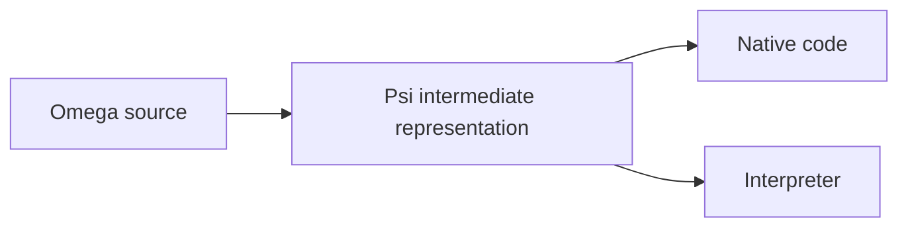

# Omega

Omega is a systems language built around explicit state machines, checked
contracts, and ownership of memory and resources.

Omega is betting on the following software trends into the future:
- LLM intelligence will increase, and costs will decrease.
- Software will permeate every aspect of our lives. Some of these areas are too costly to get wrong, like transportation and medical fields.
- It will become increasingly critical that software is fast, resource efficient, and 'just works'. No garbage collection, emulation, or bloatware layers.
- It will be necessary to validate assurances up front. Even intelligent AI can make critical mistakes.
- "Don't trust, and verify" will become necessary to avoid an onslaught of malicious or buggy code. This means provable claims about performance, capabilities, and stability.

Make trust explicit, narrow, and auditable. When this trust holds, the program keeps
its promises. There is no `unsafe` escape hatch: even inline assembly must
satisfy checked contracts.

The acyclic graph-like nature of Omega programs allow us to answer otherwise difficult questions at compile-time:
- Does an API call provably terminate? Can it crash? Under what conditions?
- Does an API access the filesystem, including through its dependencies?
- Does a program perform well under load?

Omega is being built for software where failure is costly—from aircraft systems
to OS kernels—without sacrificing performance.

Its first major application is **[Cathedral](https://github.com/CathedralOS/Cathedral)**, an operating system being developed
alongside the language. Cathedral puts the design to work on kernel problems:
managing memory, controlling hardware, and running untrusted software.

**Pre-Alpha.** The Rust compiler is under active development. The language
design is ahead of its implementation; native support is still being completed.

[Language guide](wiki/language_guide/language_guide.md) ·
[Specification](wiki/README.md#current-specification-subjects) ·
[Examples](samples/) ·
[Contributing](#development)

## Machines

A machine defines behavior, its inputs, and its contract. A simple machine looks
like an ordinary function or method:

```omega
data Player {
    health: u32;
}

machine Player::take_damage(&mut self, amount: u32)
    requires amount <= self.health
    ensures self.health == before(self.health) - amount
{
    // Guaranteed safe since amount <= self.health
    self.health = self.health - amount;
}
```

- `&mut self` borrows the player exclusively.
- `requires` is the caller's obligation: establish that the subtraction is safe.
- `ensures` is the implementation's obligation: prove the promised result.
  `before(...)` refers to the value on entry.

The caller can establish the condition through a branch or facts already known.
An unproved call is a compile error, not an automatically inserted runtime
assertion.

For longer control flow, machines contain named states and explicit transitions.
Transfers carry values and ownership without growing the call stack.
[Machines](wiki/language_guide/chapter_3_machines.md) ·
[States and transitions](wiki/language_guide/chapter_4_states_transitions.md)

## Domains and invariants

Contracts can describe relationships between fields, not just individual
arguments. A data type's `where` clause defines its **default domain**:

```omega
data Span
where
    start <= end,
{
    start: u32;
    end: u32;
}

machine Span::shift(&mut self, delta: u32)
    requires self.end <= u32::Maximum - delta
{
    self.start = self.start + delta;
    self.end = self.end + delta;
}
```

The first write can temporarily break `start <= end`. Exclusive access prevents
another observer from seeing that intermediate state; the second write restores
the relationship. Returning early or passing the broken span to a machine that
requires a valid one is rejected.

The checker proves both additions fit and that the domain holds again at return.
Neither check inserts a runtime assertion or adds a field: a span still contains
just two `u32` values.

Named domains let other contracts reuse such facts. Ordinary machines also
establish mathematical theorems, and eligible computations can be evaluated at
compile time or referenced in proofs without maintaining a separate algorithm.
[Domains](wiki/language_guide/chapter_8_domains.md) ·
[Invariant windows](wiki/language_guide/chapter_11_invariant_windows.md) ·
[Mathematical proofs](wiki/language_guide/chapter_10_compile_time_proofs.md)

## Hardware access

Ownership also applies when a device accesses memory. In this driver API sketch,
`receive` lends a nonempty buffer to a device for writing. `finish` returns only
after the device releases the loan and the required memory visibility holds:

```omega
let transfer = device.receive(&mut buffer);

// buffer[0] = 42;       // Rejected: the device holds exclusive access.
// let byte = buffer[0]; // Rejected: CPU reads are excluded too.

suspend device.finish(move transfer);

buffer[0] = 42;          // Valid after release.
```

`suspend` allows the current activation to pause; it does not discard the loan.
Losing the linear transfer token cannot release it, and a device's success
status alone is insufficient. A fallible completion must preserve the pending
obligation when release cannot be established.

The driver supplies the operations; Omega checks their composition. Hardware
behavior must be established through checked instruction contracts or explicit
provider assumptions. Required fences still execute—ownership checking does not
replace synchronization.

The same model extends to
[memory authority without runtime domain tags](wiki/spec/resources/extents.md)
and [provider selection under build policy](wiki/language_guide/chapter_19_capabilities_effects_boundaries.md).
[Device loans](wiki/spec/resources/device_access.md) ·
[Concurrency](wiki/language_guide/chapter_18_concurrency.md)

## Failures Omega addresses

These are design guarantees, within the stated trust boundaries:

- ✅ **Prevented** by required checking and admission.
- ⭐ **Conditionally prevented** on an arithmetic policy, additional proof, or trust decision;
  the row states what is covered and what remains possible.

| Failure | Guarantee | What Omega does about it |
| --- | --- | --- |
| Use-after-free, double-free, dangling references | ✅ | Ownership and borrow checking reject access after an object's lifetime and conflicting transfers. |
| Out-of-bounds reads and writes | ✅ | Array and slice access requires proof that the index or range is valid. |
| Stack overflow | ✅ | Recursion is banned, except for tail recursion which compiles as iteration. The compiler pre-calculates the worst-case stack demand, including compiler spills. |
| Integer overflow and division by zero | ⭐ | Eliminated by default, as all arithmatic defaults to compiler-enforced safety. Users have to opt-in to more dangerous modalities like trapping and wrapping. |
| Data races | ✅ | Ordinary borrows reject conflicting shared mutation; concurrent access needs an explicit synchronization contract. |
| Deadlocks and indefinite waits | ⭐ | Protocol proofs rule out wait cycles and missing wakeups for the checked composition and its stated external assumptions. Ownership alone does not promise progress. |
| Unintended infinite loops | ⭐ | A machine promising termination must prove it. Deliberately nonterminating event loops remain legal. An entire app can prove itself to terminate. |
| Malicious/covert system abuse | ✅ | APIs must declare exactly what critical system resources they reach, or the code simply will not compile. This surfaces all potentially dangerous system access points for auditing. |
| Dependency supply-chain attacks | ⭐ | Installing or upgrading a package prompts the user / LLM with trust reports, exposing potentially dangerous reachability such as network or filesystem access. Novel additions, or dangerous combinations are directly surfaced to the user or agents for auditing. |
| Compiler supply-chain attacks | ⭐ | Omega bootstraps from ~400 lines of hand written assembly, with 0 external dependencies. This assembly kernel interprets a tiny hand written Turing tape, which is used to construct increasingly powerful languages that are simple enough for a human to review them. A trusted tape checker provides strong safety guarantees of the results. |

These guarantees rely on the contracts of external code and hardware. A foreign
function that lies about its memory access, or an OS that violates its contract,
is not made safe by calling it from Omega.

## Building

Install Rust with `rustup`, clone this repository, and run from its root.
The checked-in toolchain file selects the required Rust version.

Start with a small precondition-checking case:

```sh
cargo run -p omega -- --check --output-only tests/omega/pass/constraints/scalar_requires_satisfied_by_literal/main.omg
```

It should finish successfully: its call supplies `5` to a machine requiring
a positive value. This checks source; it does not emit or run a native program.
`--output-only` omits auxiliary reports.

For a full application, start with the [CLI example](samples/cli/basics/cli_mvp/README.md).
Its instructions distinguish the intended result from the current compiler
limitations.

## Compiler Pipeline

Omega source compiles to **Psi**, a portable intermediate binary that can be
lowered to **native code** or **run by an interpreter** for scripting.



Psi carries proof evidence so a receiving compiler or interpreter can check its
contracts and declared capabilities independently of the producer.
[Follow the pipeline →](omega-rust/pipeline.md)

The separate [bootstrap chain](bootstrap/README.md) works toward constructing
the compiler from a small auditable starting point. It is not required to work
on the Rust implementation.

## Explore

| If you want to… | Start here |
| --- | --- |
| Learn the language | [Language guide](wiki/language_guide/language_guide.md) |
| Look up an exact rule | [Language and toolchain specification](wiki/README.md) |
| Explore programs and library code | [Samples](samples/) · [Bundled library](source/library/) |
| Work on the current compiler | [Rust implementation](omega-rust/README.md) |
| Read the self-hosted compiler sources | [Product source](source/README.md) |
| Understand bootstrap and trust | [Bootstrap](bootstrap/README.md) |
| Discuss a language change | [Proposals](wiki/proposals/README.md) · [Open decisions](OWNER_QUESTIONS.md) |

## Development

Current work prioritizes finishing the Rust compiler before self-hosting and
bootstrap completion. The [compiler board](TASKS.md),
[optimizer board](TASKS_OPTIMIZER.md), and
[completion criteria](wiki/drafts/rust_compiler_completion.md) describe the work.

Read [repository conventions](AGENTS.md#repository-conventions) before changing
code. [Local testing](tools/testing.md) covers focused checks and supported
development hosts.
