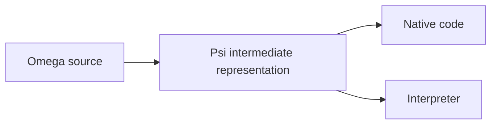

# Omega

Omega is a systems language built around explicit state machines, checked
contracts, and ownership of memory and resources.

Make trust explicit. Prove that, when those assumptions hold, the program keeps
its promises. There is no `unsafe` escape hatch: even inline assembly must
satisfy checked contracts or rely on explicitly admitted assumptions.

These contracts make questions about program behavior part of checking:

- Which operations are proved to terminate?
- Can this API access the filesystem, including through its dependencies?
- Under what conditions can this operation crash?

Omega is being built for software where failure is costly—from aircraft systems
to OS kernels—without sacrificing performance.

Its first major application is **[Cathedral](https://github.com/CathedralOS/Cathedral)**, an operating system being developed
alongside the language. Cathedral puts the design to work on kernel problems:
managing memory, controlling hardware, and running untrusted software.

**Pre-Alpha.** The Rust compiler is under active development. The language
design is ahead of its implementation; native support is still being completed.

[Language guide](wiki/language_guide/language_guide.md) ·
[Specification](wiki/README.md#current-specification-subjects) ·
[Examples](samples/) ·
[Contributing](#development)

## What this lets you build

These sketches use illustrative package APIs with the contracts described below.
Devices, allocators, and storage services are library code, not special language
constructs.

### The borrow checker includes your hardware

A device writing into memory holds an exclusive loan, just as another machine
would. Here `receive` starts that loan; `finish` returns only after the device has
released it and the required memory visibility has been established.

```omega
let transfer = device.receive(&mut buffer);

// buffer[0] = 42;                 // Rejected: the device holds the buffer.
// let byte = buffer[0];           // Rejected: reading races the device too.

suspend device.finish(move transfer);

buffer[0] = 42;                    // Valid: CPU access has been restored.
```

Suspension preserves the loan. Losing the linear transfer token cannot silently
release it, and a device's “success” bit is not proof that it stopped accessing
memory. A fallible completion must return the pending obligation when release
cannot be established. The selected provider must establish confinement and
ordering through checked code or explicit hardware assumptions.

The transfer and any required fences are real runtime work. Tracking the loan
does not add a runtime borrow checker. [Device loans and completion →](wiki/spec/resources/device_access.md)

### Permissions without runtime tags

An `Extent` stores an address and a length. The domain in `Extent in Granted`
records established permission to use the storage—not another field. Constructing identical
address and length values cannot forge that permission.

Given sufficient granted, writable, vacant storage, an allocator can split the
region and place a value into one part. The caller proves the required size and
alignment:

```omega
let parts = memory.split(move region, 4096);
let header = memory.place<Header>(move parts.left);

// memory.clear(&mut region);      // Rejected: the parent was consumed.
// memory.place<Header>(move parts.left); // Rejected: already moved into header.
```

The split must prove that its children are disjoint and cover the original
range. Merely returning two lengths that add up is insufficient. Placement
establishes the chosen layout, alignment, and value's validity. The header keeps
its backing storage owned; the remaining part stays separately owned.

The bound `embed(base) + embed(length) <= addr::Bound` uses unbounded mathematical
integers: even a range's one-past endpoint need not fit in an address register.
The executable keeps ordinary addresses and lengths—not big integers, permission tags, or a runtime
proof object. Initialization still does its actual work.
[Memory authority](wiki/spec/resources/extents.md) ·
[Domains](wiki/language_guide/chapter_8_domains.md) ·
[Proofs and erasure](wiki/language_guide/chapter_10_compile_time_proofs.md)

### A dependency cannot quietly expand your permissions

`build.omg` selects implementations using ordinary Omega code. Suppose the
receiving policy allows local file access but no network access:

```omega
machine build(builder: &mut Build) {
    builder.application("archive-reader");
    builder.select_provider<Storage, LocalStorage>();
}
```

Changing the selection to a network-backed implementation exposes a different
authority requirement:

```omega
builder.select_provider<Storage, RemoteStorage>(); // Rejected by this policy.
```

The name `Storage` cannot hide the selected implementation's network access.
A provider must satisfy both the service contract and the receiving policy;
selecting it grants neither extra permissions nor trust in its claims.
Replacing an admitted foreign implementation with checked Omega code can remove
that admission, but only after proving the required contract.

Provider selection is build-time work. A fused build can call the selected
implementation directly; this does not require a runtime permission broker.
[Boundaries and provider selection →](wiki/language_guide/chapter_19_capabilities_effects_boundaries.md)

### One machine, several uses

A pure, terminating checksum machine need not be rewritten for each context:

| Use | What happens |
| --- | --- |
| `checksum(bytes)` | Compute over runtime input. |
| Evaluate it on fixed bytes in a constant context | Compute during compilation. |
| Refer to its result in a proof contract | Reason about the same computation without a runtime call. |
| `runtime.start<checksum>(bytes)` | Ask a task runtime to run it in another activation. |

There is no separate `checksum_async`, `checksum_const`, or duplicated
specification algorithm. Each use still checks eligibility, authority, and
ownership: starting a task with borrowed bytes must keep their owner alive until
the task releases them. An effectful machine does not become a mathematical
function merely by appearing in a proof.
[Machines](wiki/language_guide/chapter_3_machines.md) ·
[Concurrency](wiki/language_guide/chapter_18_concurrency.md)

## Failures Omega addresses

These are design guarantees, within the stated trust boundaries:

- ✅ **Prevented** by required checking and admission.
- ⭐ **Conditional** on an arithmetic policy, additional proof, or trust decision;
  the row states what is covered and what remains possible.

| Failure | Guarantee | What Omega does about it |
| --- | --- | --- |
| Use-after-free, double-free, dangling references | ✅ | Ownership and borrow checking reject access after an object's lifetime and conflicting transfers. |
| Out-of-bounds reads and writes | ✅ | Array and slice access requires proof that the index or range is valid. |
| Stack overflow | ✅ | Tail recursion becomes iteration. Worst-case stack demand, including compiler spills, must fit provisioned storage before execution. |
| Integer overflow and division by zero | ⭐ | Exact arithmetic is the default and requires proof of validity. Explicit wrapping, saturation, or trapping policies choose other behavior rather than promising failure-free arithmetic. |
| Data races | ✅ | Ordinary borrows reject conflicting shared mutation; concurrent access needs an explicit synchronization contract. |
| Deadlocks and indefinite waits | ⭐ | Protocol proofs rule out wait cycles and missing wakeups for the checked composition and its stated external assumptions. Ownership alone does not promise progress. |
| Unintended infinite loops | ⭐ | A machine promising termination must prove it. Deliberately nonterminating event loops remain legal. |
| Hidden filesystem or process authority | ✅ | Boundary effects propagate through calls; a build cannot silently grant authority its receiving policy disallows. |
| Dependency supply-chain attacks | ⭐ | Package review exposes dependency changes, trust assumptions, and requested authority. New authority needs acceptance; malicious use of already-approved permissions is not automatically detected. |
| Compiler supply-chain attacks | ⭐ | Independent verification rejects compiler output that violates the checked contracts, even if the producer is compromised. This relies on a trusted checker and binding the artifact to the intended program. |

These guarantees rely on the contracts of external code and hardware. A foreign
function that lies about its memory access, or an OS that violates its contract,
is not made safe by calling it from Omega.

## Building

Install Rust with `rustup`, clone this repository, and run from its root.
The checked-in toolchain file selects the required Rust version.

Start with a small precondition-checking case:

```sh
cargo run -p omega -- --check --output-only tests/omega/pass/constraints/scalar_requires_satisfied_by_literal/main.omg
```

It should finish successfully: its call supplies `5` to a machine requiring
a positive value. This checks source; it does not emit or run a native program.
`--output-only` omits auxiliary reports.

For a full application, start with the [CLI example](samples/cli/basics/cli_mvp/README.md).
Its instructions distinguish the intended result from the current compiler
limitations.

## Compiler Pipeline

Omega source compiles to **Psi**, a portable intermediate binary that can be
lowered to **native code** or **run by an interpreter** for scripting.



Psi carries proof evidence so a receiving compiler or interpreter can check its
contracts and declared capabilities independently of the producer.
[Follow the pipeline →](omega-rust/pipeline.md)

The separate [bootstrap chain](bootstrap/README.md) works toward constructing
the compiler from a small auditable starting point. It is not required to work
on the Rust implementation.

## Explore

| If you want to… | Start here |
| --- | --- |
| Learn the language | [Language guide](wiki/language_guide/language_guide.md) |
| Look up an exact rule | [Language and toolchain specification](wiki/README.md) |
| Explore programs and library code | [Samples](samples/) · [Bundled library](source/library/) |
| Work on the current compiler | [Rust implementation](omega-rust/README.md) |
| Read the self-hosted compiler sources | [Product source](source/README.md) |
| Understand bootstrap and trust | [Bootstrap](bootstrap/README.md) |
| Discuss a language change | [Proposals](wiki/proposals/README.md) · [Open decisions](OWNER_QUESTIONS.md) |

## Development

Current work prioritizes finishing the Rust compiler before self-hosting and
bootstrap completion. The [compiler board](TASKS.md),
[optimizer board](TASKS_OPTIMIZER.md), and
[completion criteria](wiki/drafts/rust_compiler_completion.md) describe the work.

Read [repository conventions](AGENTS.md#repository-conventions) before changing
code. [Local testing](tools/testing.md) covers focused checks and supported
development hosts.
