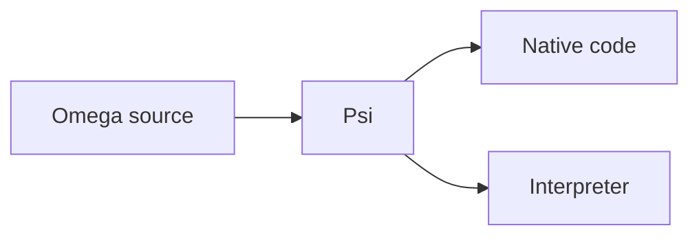

# Omega

A systems language built around explicit state machines, checked contracts,
and ownership of memory and resources.

**Pre-Alpha.** The Rust compiler is under active development. The language
design is ahead of its implementation; native support is still being completed.

[Language guide](wiki/language_guide/language_guide.md) ·
[Specification](wiki/README.md#current-specification-subjects) ·
[Examples](samples/) ·
[Contributing](#development)

## What it looks like

A language example: removing health from a player without unsigned underflow.

```omega
data Player {
    health: u32;
}

machine Player::take_damage(&mut self, amount: u32)
    requires amount <= self.health
    ensures self.health == before(self.health) - amount
{
    self.health = self.health - amount;
}
```

- **`requires`**: the caller establishes that damage does not exceed current
  health, using a branch or facts it already knows.
- **`ensures`**: the implementation must establish the promised result.
  `before(...)` refers to the value on entry.
- **`&mut self`**: the operation borrows the player exclusively; conflicting
  access through another ordinary borrow is rejected.

The condition makes subtraction valid. Failing to prove it is a compile error,
not an automatically inserted runtime assertion. This is a design example;
the [contract guide](wiki/language_guide/chapter_7_types_constraints_invariants.md)
explains the model in more depth.

For longer control flow, a machine contains named states and explicit
transitions. State transfers carry their inputs and do not grow the call stack.
See [states and transitions](wiki/language_guide/chapter_4_states_transitions.md).

## Proving mathematics

The same contract syntax can state a theorem: **(a + b)(a − b) = a² − b²**.

```omega
machine difference_of_squares(a: Int, b: Int)
    ensures (a + b) * (a - b) == a * a - b * b
{
}
```

`Int` is an unbounded mathematical integer, not a machine-sized `i32`.
The theorem covers every `a` and `b`, rather than selected test values.

The empty body asks the checker to establish the identity; it does not assume
it. Algebraic normalization is enough here. Harder proofs use helper machines,
explicit hypotheses, and induction.

A proved machine's contract can be used in another proof, or to justify an
operation in systems code. See
[compile-time proofs](wiki/language_guide/chapter_10_compile_time_proofs.md).

## Failures Omega addresses

| Failure | What Omega does about it |
| --- | --- |
| Use-after-free, double-free, dangling references | Ownership and borrow checking reject access after an object's lifetime and conflicting transfers. |
| Out-of-bounds reads and writes | Array and slice access requires proof that the index or range is valid. |
| Stack overflow | Tail recursion becomes iteration. Worst-case stack demand, including compiler spills, must fit provisioned storage before execution. |
| Accidental integer overflow and division by zero | Exact arithmetic requires proof that the operation is valid. Wrapping, saturation, and runtime trapping are explicit choices. |
| Data races | Ordinary borrows reject conflicting shared mutation; concurrent access needs an explicit synchronization contract. |
| Deadlocks and indefinite waits | Protocol proofs can rule out wait cycles and missing wakeups for a checked composition. Ownership alone does not promise progress. |
| Unintended infinite loops | A machine promising termination must prove it. Deliberately nonterminating event loops remain legal. |
| Hidden filesystem or process authority | Boundary effects propagate through calls; a build cannot silently grant authority its receiving policy disallows. |

These guarantees rely on the contracts of external code and hardware. A foreign
function that lies about its memory access, or an OS that violates its contract,
is not made safe by calling it from Omega.

## Building

Install Rust with `rustup`, clone this repository, and run from its root.
The checked-in toolchain file selects the required Rust version.

Start with a small precondition-checking case:

```sh
cargo run -p omega -- --check --output-only tests/omega/pass/constraints/scalar_requires_satisfied_by_literal/main.omg
```

It should finish successfully: its call supplies `5` to a machine requiring
a positive value. This checks source; it does not emit or run a native program.
`--output-only` omits auxiliary reports.

For a full application, start with the [CLI example](samples/cli/basics/cli_mvp/README.md).
Its instructions distinguish the intended result from the current compiler
limitations.

## Compiler Pipeline

Omega source compiles to **Psi**, a portable intermediate binary that can be
lowered to native code or run through an interpreter. Like WebAssembly, it
separates a program from a particular CPU; it is a different format, not
WASM-compatible or browser-specific.



Source checking and native compilation can happen in separate invocations.
Both consumers verify the Psi product.
[Follow the pipeline →](omega-rust/pipeline.md)

The separate [bootstrap chain](bootstrap/README.md) works toward constructing
the compiler from a small auditable starting point. It is not required to work
on the Rust implementation.

## Explore

| If you want to… | Start here |
| --- | --- |
| Learn the language | [Language guide](wiki/language_guide/language_guide.md) |
| Look up an exact rule | [Language and toolchain specification](wiki/README.md) |
| Explore programs and library code | [Samples](samples/) · [Bundled library](source/library/) |
| Work on the current compiler | [Rust implementation](omega-rust/README.md) |
| Read the self-hosted compiler sources | [Product source](source/README.md) |
| Understand bootstrap and trust | [Bootstrap](bootstrap/README.md) |
| Discuss a language change | [Proposals](wiki/proposals/README.md) · [Open decisions](OWNER_QUESTIONS.md) |

## Development

Current work prioritizes finishing the Rust compiler before self-hosting and
bootstrap completion. The [compiler board](TASKS.md),
[optimizer board](TASKS_OPTIMIZER.md), and
[completion criteria](wiki/drafts/rust_compiler_completion.md) describe the work.

Read [repository conventions](AGENTS.md#repository-conventions) before changing
code. [Local testing](tools/testing.md) covers focused checks and supported
development hosts.
