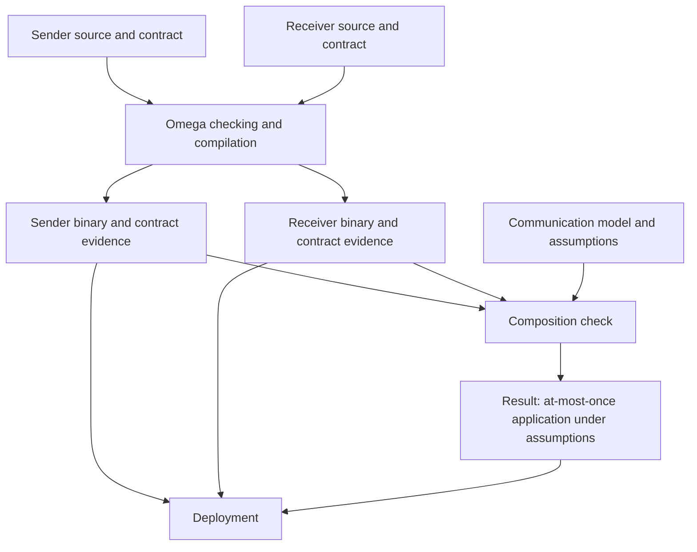
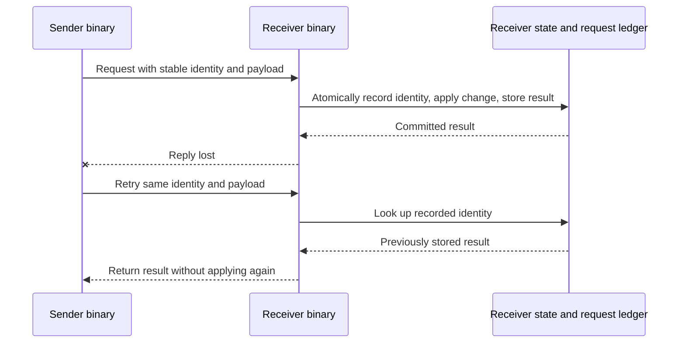
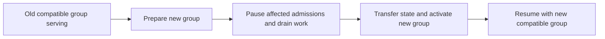

# Zac-Jarod

## Direction

Explore proving communication guarantees across separately compiled Omega
programs using Omega and its tooling. Jarod wants this capability to stay under
Omega's control, without requiring another language.

This is a direction to investigate, not approval for a new subsystem or syntax.
First establish what Omega already supports and what information it needs to
check the desired guarantees. This note does not establish a current feature gap.

## Feature map for Zac

This table collects the capabilities discussed so Zac can assess the whole
direction. It is not a list of absent Omega features or an implementation board.
"Required" records Jarod's live-update direction or a condition necessary to
make that direction safe. "Explore" records the desired investigation into
cross-binary guarantees. "Candidate" means potentially useful, not approved
implementation scope. Existing specification coverage is not proof of runtime
implementation; the source review so far is partial.

| Capability | Intent | What it would provide | Known coverage or open boundary |
| --- | --- | --- | --- |
| Live component replacement | Required | Update running services and the OS through explicit replaceable boundaries. | Substantial component-publication specification exists; runtime coverage needs auditing. |
| Independently deployable components | Required for independent updates | Replace a component without rebuilding every consumer when its contracts permit it. | Specified component closures and independent composition; implementation coverage unverified. |
| Replacement compatibility checks | Required | Admit replacements only when callers' behavioral, state, resource, and authority requirements remain satisfied. | Existing replacement-envelope specification; complete enforcement unverified. |
| State continuity and migration | Required where updates retain state | Preserve state or perform a checked transition to a new representation. | Existing continuity requirements; supported migration cases need checking. |
| Safe retirement of old code | Required | Keep code and resources alive until active calls and retained users have finished. | Existing era-entry and quiescence contracts; runtime coverage unverified. |
| Coordinated update groups | Required when versions depend on one another | Ensure no operation observes an incompatible version combination during an update. | Proposed workflow in this note; reconcile with existing replacement-cohort contracts. |
| Update failure recovery | Required for the promised failure model | Recover safely from interrupted preparation, activation, or state transfer. | Protocol, recovery records, and permissible rollback points need definition. |
| Contract export | Explore | Publish each component's requirements, guarantees, and build-linked evidence. | Existing component import/export contracts overlap; exact reusable artifact support needs tracing. |
| Contract composition | Explore | Establish properties across independently compiled components and identify remaining environmental assumptions. | Existing consumer-validation contracts overlap; proof mechanism and supported properties need tracing. |
| Deployment description and enforcement | Explore | Connect checked contracts to the actual instances, routes, and authority used at runtime. | Compiler evidence and OS enforcement responsibilities must be connected explicitly. |
| Retry and duplicate-application guarantees | Explore | Establish at-most-once application for a request identity under stated assumptions. | Proposed first example; not established as a current Omega proof capability. |
| Per-service time-window limits | Explore | Accept at most one request per authenticated service within the chosen window policy. | Receiver-side property; clock, concurrency, identity, and recovery assumptions remain explicit. |
| Crash, restart, and failover proofs | Explore | Preserve selected safety rules through modeled failures. | Depends on the program's recovery protocol; not a universal automatic guarantee. |
| Bounded queues and admission control | Explore | Keep queued and active work within limits and reject excess work before the protected action. | Proposed property; resource accounting and cancellation behavior must be covered. |
| Explicit proof scope | Explore | Distinguish normal-execution, failure, resource, and progress guarantees in reported evidence. | Proposed reporting principle; current coverage needs checking. |
| Execution placement | Candidate | Select shared execution, dedicated threads, cores, or memory locality without scattering those choices through business logic. | Provider selection offers related separation; actual placement facilities need auditing. |
| Transport selection | Candidate | Select local calls, queues, sockets, or other transports while preserving required communication semantics. | Related provider contracts exist; equivalent behavior across transports is not established. |
| Declarative message routing | Candidate | Describe keyed delivery and fan-out directly, including unmatched-message behavior. | Omega coverage not established in this review. |
| Reusable verified recovery mechanisms | Candidate | Supply retry, persistence, and recovery building blocks with explicit assumptions. | Reuse existing libraries where available; no new library subsystem approved. |
| Authenticated service identity | Needed by identity-based guarantees | Enforce caller permissions and limits against a verified identity rather than a payload claim. | Selected security mechanisms and credential lifecycle remain application/OS concerns. |
| Challenge-response authentication | Candidate mechanism | Establish possession of a credential using a fresh challenge. | Does not establish executable identity by itself. |
| Remote software attestation | Candidate | Obtain trusted evidence about approved software tied to a session or key. | Requires an appropriate trust mechanism and approval policy; not necessary for every service contract. |
| Verifiable computation | Candidate | Check that a result follows from a specified program and inputs. | Omega support unverified; does not by itself identify the caller's executable. |
| Updateable software approval policy | Candidate | Approve new software builds without embedding each approved measurement in every receiver. | Policy authentication, authority, and revocation need definition if selected. |
| Service reach and execution restrictions | Existing design to reuse | Constrain service access, suspension, blocking, and crash behavior. | Specified in Omega; this review did not establish complete implementation coverage. |
| Ownership and lifetime guarantees | Existing design to reuse | Preserve valid storage access and resource ownership across component boundaries. | Specified in Omega; replacement must preserve these obligations. |
| Provider selection | Existing design to reuse | Separate a required interface from the selected admitted implementation. | Specified in Omega; does not alone establish live replacement or remote relocation. |

Zero-pause updates, arbitrary incompatible replacements, guaranteed service under
unlimited overload, and unconditional security are not implied by this table.
Each accepted feature needs a concrete property, customer, and evidence boundary.

## What we want to understand

A program can be checked against assumptions about its environment. When another
program supplies that environment, can Omega check that its guarantees satisfy
the first program's assumptions?

Separate binaries are not inherently a barrier to that reasoning. The checker
needs descriptions of their contracts and relevant communication behavior.
Whether the current implementation provides these descriptions and checks must
be established from the source.

For example, a service might require every incoming command to have passed an
authorization check. A composition check could establish that the declared paths
satisfy that requirement if the contracts describe authorization and the model
covers every relevant path. Matching message types alone would not establish it.

## Guarantees across binaries

The aim is to establish specific guarantees about communicating programs using
Omega itself. Separate compilation does not inherently prevent a proof across
their combined behavior. Such a proof requires contracts and a communication
model expressive enough to describe the property and its assumptions.

For example, a protocol could guarantee that retrying a request never applies
the same state change twice. Establishing that requires proving the request
identity, duplicate handling, and state-update behavior together, including
persistence and recovery if crashes are part of the model. Merely checking
connections or matching API types would not prove it.

This is possible in principle, not a claim that Omega's current proof system
already establishes this example. The guarantee holds under the stated
assumptions, with evidence that the actual implementations and deployment
preserve the modeled behavior. Another language is not inherently required.

## A possible development flow

1. Build service A against an explicit contract for the service it needs. Its
   proof remains conditional on that contract; service B need not exist yet.
2. Build B later and check that its guarantees satisfy A's requirements.
3. Describe their intended connections in separately updateable composition
   metadata, if existing Omega facilities do not already express this.
4. Check the composition when adding or changing services. Rebuild an existing
   binary only when its code, interface, or embedded assumptions need to change.

This is a proposed workflow, not a description of implemented commands. The
documented source-checking form is `omega --check <root.omg>`; no fleet command
is specified here.

## Where the information could live

Each build could expose its relevant interface contracts as an artifact. A
separate composition description could reference those artifacts and describe
intended connections. The checker would consume both. Existing build or proof
artifacts may suffice; a new language, central service, or whole-fleet graph
embedded in every binary is not inherently required.

At runtime, programs would receive the endpoints or capabilities they need
through the chosen deployment mechanism. They would not automatically know the
complete graph merely because it had been checked during the build.

## What a check would guarantee

A check establishes a stated property of the model under stated assumptions.
Applying that result to running services also requires the actual deployment and
communication mechanisms to uphold those assumptions. A checked file alone does
not prevent an operator from starting another process or creating another route.

The necessary enforcement depends on the property. It may come from deployment
controls, OS capabilities, authenticated connections, or runtime protocols.
Deciding that boundary comes before deciding whether startup checks are enough.

Having one publisher does not itself prevent duplicate messages: a single
publisher can retry. Preventing duplicate business effects requires suitable
processing semantics, such as deduplication or idempotency. Topology checks alone
do not provide atomicity, ACID transactions, or exactly-once effects.

## Naive first implementation

Start with two programs: a sender that retries a command, and a receiver that
applies it. Prove one bounded property: a given request identity changes the
receiver's state at most once. This is at-most-once application, not a promise
that every request eventually succeeds.

The following is a proposed design, not existing Omega syntax or tooling.

The composition check belongs with target-neutral proof work on the Psi side
if implemented in the compiler. Build tooling can gather inputs and invoke it;
native emission stays on the Omega side. First inspect existing contract and
evidence facilities before choosing any new artifact format or compiler API.

### Runtime behavior to model

For the first model, use one receiver with serialized transitions and an
in-memory ledger. Allow message loss, duplication, and retries, but exclude
process restarts and external side effects. This keeps the first proof about
the protocol rather than a storage or distributed-consensus implementation.

An accepted new request updates the business state and ledger in one modeled
transition. A repeated identity with the same payload returns its stored result.
A repeated identity with a different payload is rejected. The sender reuses the
identity on retries and never assigns it to a different logical request.

### Small implementation steps

1. Express the sender, receiver, and message behavior as Omega state machines.
   Define the invariant: each request identity has at most one application.
2. Prove that initialization and every permitted transition preserve the
   invariant. Include duplicate delivery and lost replies. A finite exploration
   can help find mistakes, but its result applies only to the explored bounds
   unless a general proof is also established.
3. Compile the two programs separately. Establish how each implementation is
   connected to its modeled transitions; a proof of a separate model alone is
   insufficient evidence about the emitted binaries.
4. Supply their contracts and the communication assumptions to a composition
   check. Initially, use a fixed two-program composition rather than general
   fleet discovery or a new deployment language.
5. Produce a result stating the property, checked inputs, and assumptions. Test
   duplicate delivery and lost replies against the implementation as regression
   checks; those tests supplement the proof rather than replace it.

Acceptance for this first experiment is an invariant proof connected to both
implementations, plus a rejected deliberately broken receiver that applies
retries again. If Omega cannot yet express or discharge an obligation, record
that exact missing capability instead of treating a simulation as a proof.

### Deliberate limits

The first guarantee covers one receiver lifetime and changes to its modeled
state. It does not cover two receiver replicas, restarts, ledger eviction,
identity reuse, or an external payment or other side effect. Keep ledger entries
for that lifetime; a bounded implementation must reject new requests when full
rather than forget identities and silently invalidate the guarantee.

Adding crash recovery requires durable, atomic updates to state and the ledger,
with a recovery model. Adding replicas requires a protocol that preserves the
same invariant across them. External effects require a corresponding contract
from the external system. These are later proof obligations, not prerequisites
for the first bounded experiment.

## Contract export and composition are separate responsibilities

Contract export describes one program independently: what it requires from its
environment and what it guarantees when those requirements hold. Any evidence
must be tied to the relevant build and its interfaces. For example: "If retries
preserve request identity, this receiver applies each request at most once,"
subject to the lifetime and storage assumptions described above.

Composition checks several such contracts together. Does the sender preserve
identity as required by the receiver? Does the communication model preserve the
assumptions needed by both? Which requirements remain obligations of deployment,
storage, or other environmental mechanisms? Circular assumptions are not proof;
the reasoning must establish that the combined behavior preserves the property.

The two-service example is a potential client of these responsibilities, not
their definition. Export formats and the composition proof mechanism remain
open. The earlier diagram's composition-check box does not yet specify them.

The retry example also has a limitation as a demonstration: most of its safety
comes from the receiver. Proving it alone would not establish a general facility
for composing independently compiled programs. Likewise, the modeled atomic
state-and-ledger update needs implementation evidence, including error paths.

## Example: 100 callers and a time window

Desired property: for each authenticated service identity, the receiver accepts
at most one request within the specified window, even with concurrent arrivals.
This limits acceptance, not attempted calls or network traffic. It does not
itself guarantee availability under excessive traffic.

Two different policies were discussed and remain to be chosen:

- Fixed windows: one acceptance per service per defined interval. Requests just
  before and after a boundary can both be accepted very close together.
- Minimum spacing: successive acceptances for a service must be at least a
  specified duration apart, such as 60 seconds.

The receiver authenticates and authorizes the caller, consults that identity's
acceptance record, and records a successful acceptance without allowing another
request to slip between the check and update. A serialized transition is one
possible implementation. The proof must cover concurrency, time comparisons,
and record updates, not just the ordinary sequential request path.

The assumptions include the meaning of service identity, suitable clock behavior,
and how records survive or reset on restart. Multiple receiver replicas need
coordination if the limit is global. Multiple credentials for one logical service
must map to the same identity if they are meant to share a limit.

This property can be enforced by the receiver against arbitrary callers without
proving all 100 caller programs. It is provable in principle under an appropriate
model; current Omega support for the necessary obligations is unverified.

## Untrusted callers and software identity

A payload containing a service name or executable hash is only a claim. Another
program can send the same bytes. The receiver must authenticate identity and
enforce permission and acceptance rules before performing the protected action.
Its proof should permit malformed or hostile incoming requests rather than
assume that every caller follows a cooperative contract.

Certificates, used in a protocol that verifies possession of the corresponding
private key and validates the peer, can authenticate a remote service. Being on
another machine does not invalidate that protection. Authentication ordinarily
identifies a credential holder, not the exact executable using the credential.
If credentials are stolen, another program may act as that service. The limit
can still apply to that identity, but identity alone cannot distinguish the
legitimate process from the credential thief.

Checking a specific executable requires additional trusted evidence. On one
machine, an OS can control which processes receive communication capabilities;
whether this establishes executable identity depends on its launch and security
policy. Across machines, attestation can provide evidence of measured software
or an execution environment under the attestation mechanism's trust assumptions.

## Challenge-response and attestation

Challenge-response starts with a fresh, unpredictable challenge from the
receiver. The caller returns a response the receiver can verify. A publicly
computable hash of that challenge does not authenticate the executable: another
program can compute it. A signature can demonstrate possession of a private
key, but that alone still does not establish which executable used the key.

Attestation adds a trusted source of evidence, often backed by hardware, about
software measurements or an execution environment. The verifier checks that
evidence against an approval policy. Evidence must be fresh and bound to the
relevant session or key to address replay and substitution; freshness alone does
not establish that binding. The exact evidence depends on the mechanism: a boot
measurement is not automatically a measurement of the currently calling process.

Attestation is not a proof that approved software is bug-free, that the entire
remote machine contains no other code, or that the measured software cannot be
compromised. It establishes the specific facts covered by its mechanism and
trust assumptions.

## Proving a computation versus identifying its caller

In principle, verifiable computation can establish that a result follows from a
specified program applied to specified inputs, potentially including a fresh
challenge. This requires a suitable proof system and an explicit relationship
between the verified program representation and the compiled artifact. It is
not an established Omega feature in this note.

Such a proof does not show that the remote machine is running only that program.
Another program could execute it, emulate it, or relay the challenge and return
the resulting proof. From protocol messages alone, the receiver cannot
distinguish implementations that produce the same observable responses.

Evidence about the caller's executable therefore needs a trusted connection
between software identity and the communicating endpoint, beyond self-reported
names, hashes, or correct answers. Attestation is one possible mechanism, with
the limits above.

## Updates and the boundary of guarantees

An exact executable measurement normally changes when a new build is produced.
Approving a new build is therefore a policy question. An external, authenticated
approval policy could allow updates without rebuilding every receiver; embedding
only one accepted measurement would instead require updating that embedded
policy. This is a design option, not a chosen implementation. Contract
compatibility and approval of a software build are separate checks.

There is no unconditional promise of 100 percent protection. Useful guarantees
state exactly what cannot happen and under which assumptions. For example:
"Requests without successful authentication are never accepted" is a property
of the receiver's enforcement, subject to its implementation and authentication
model. It does not establish that keys cannot be stolen or hardware compromised.

Omega proofs, authentication, deployment controls, and attestation address
different obligations. Combining them can strengthen a system's evidence, but
does not remove the need to name the trusted components and failure assumptions.

## Crashes, restarts, and failover

A stopped binary cannot accept requests. Callers may still attempt requests,
receive connection failures or timeouts, and retry. A timeout does not establish
that an operation never happened: the receiver may have committed it before
failing to return a reply.

Refusing requests during recovery means that the restarted receiver or takeover
instance does not accept new work until it can enforce the promised rule. It
does not mean the stopped process actively prevents callers from sending.

The state that must survive depends on the guarantee. A per-process-lifetime
limit can use in-memory records. A limit spanning restarts needs enough recovered
information to enforce it, or a conservative recovery policy that delays
acceptance until prior activity cannot violate the rule. Durable per-request
records are one approach, not a universal requirement for every program.

For a time-window limit, waiting out earlier activity requires a justified clock
and window model. Resetting a process-local timer alone does not establish how
much real time has elapsed. Losing all relevant information does not permit the
program to infer that a caller has an unused allowance.

Failover must preserve the same rule across instances. A takeover instance needs
the required state or a safe restriction on acceptance. The protocol must also
prevent an old instance from continuing to act independently, for example by
enforcing exclusive authority at the resource where the action takes effect.
Merely declaring a new leader does not establish that the old one has stopped.

During communication failures, strict shared limits can require refusing some
requests. A design may preallocate exclusive allowances to reduce coordination,
but it still needs to prove those allowances cannot overlap. A safety proof does
not by itself establish uninterrupted availability or eventual completion.

## How a proof includes failures

Treat failures as permitted steps in the state machine alongside ordinary
requests. State the invariant precisely, such as: "Each authenticated service
has at most one acceptance in each fixed window." Define the acceptance event
and window boundaries so the proof has an unambiguous subject.

- A crash discards volatile state and preserves only what the storage model
  promises. Interrupted writes follow that model, not an assumption that every
  attempted write succeeded.
- Restart reconstructs state and establishes the conditions required before
  acceptance resumes.
- Failover changes which instance has authority while preserving the invariant,
  including delayed messages and an old instance returning if those are allowed.

The proof establishes that the invariant holds initially and is preserved by
every permitted transition. Crashes must be possible between implementation
steps unless their indivisibility is supported by the underlying mechanism.

For example, accepting a request and only afterward persisting its record leaves
a possible crash between those actions. After restart, the missing record could
allow a second acceptance. A proof covering that execution would fail. The
implementation must establish a safe ordering or atomic protocol, and define
what happens if a crash occurs after recording acceptance but before replying.
External effects require their own coordination contract, as discussed above.

Coverage is conditional on the stated failure model. A proof that assumes durable
storage survives crashes does not cover destruction of that storage. A proof of
one receiver does not automatically cover replicas. Current Omega support for
these proof obligations remains to be established.

## Programmer choices and possible defaults

Programmers choose the required behavior: whether requests may be dropped,
whether guarantees span restarts, whether failover is needed, and which failures
the program must tolerate. These requirements determine the necessary protocol
and evidence; persistence and replication are not automatic requirements for
every Omega program.

Omega libraries or tooling could supply reusable verified mechanisms for retries,
persistence, and recovery. Their guarantees would still depend on explicit
contracts for the storage, clocks, communication, and execution mechanisms they
use. This is a possible direction, not a commitment to build those facilities.

A proposed checker principle is to report the scope of each result explicitly:
normal-execution evidence must not silently count as crash-recovery evidence.
When a requested guarantee includes failures, missing obligations must remain
visible rather than producing an unconditional success claim. This is proposed
behavior, not a statement of the current Omega implementation.

## Overload and admission control

A service needs an explicit policy when incoming work exceeds its capacity.
For example, permit at most ten active requests and another hundred waiting;
reject additional requests with a busy response before admitting them. These
numbers are illustrative, not proposed Omega defaults. Admission checks and
capacity reservations must remain correct under concurrent arrivals.

Callers can reduce their sending rate and retry with bounded backoff, potentially
with jitter to avoid synchronized retries. Uncontrolled retries can amplify
overload. The receiver must enforce its bounds even when callers ignore that
guidance; cooperative backoff is not its sole protection.

Possible proof obligations include:

- Active work and queued work never exceed their declared bounds.
- Requests rejected before admission do not perform the protected business action.
- Capacity is released correctly when work completes, fails, or is cancelled,
  without releasing it while the work still consumes the protected resource.
- Retry handling preserves the original duplicate-application guarantee.

A request-count bound alone does not bound total memory or processing cost.
Payload sizes, per-request allocations, and other resource use need appropriate
limits if those are part of the promised resource guarantee. A bounded application
queue also does not by itself prevent network saturation.

Distinguish a definite rejection before admission from accepted work that is
queued or executing. A timeout or missing reply does not establish rejection.
Retries of uncertain requests must preserve request identity and follow the
duplicate-handling protocol rather than assume the earlier attempt did nothing.

Capacity safety does not prove that every request is eventually served or meets
a deadline. Those guarantees need additional assumptions about incoming traffic,
processing time, scheduling fairness, and failures. This section describes
possible properties and policies; current Omega proof support is unverified.

## Live updates are a core requirement

Jarod's direction is that Omega and the operating system support updating running
systems. Live replacement is a foundational requirement for this design, not an
optional convenience justified only after restart-based deployment falls short.
The particular mechanisms and current implementation coverage remain open.

Omega supplies contracts and evidence for replacement compatibility, state
continuity, resource requirements, and safe retirement. The operating system
owns installation policy, coordination, activation, and runtime lifecycle.
Existing component-publication contracts already address much of this territory;
implementation work should follow those contracts rather than invent a parallel
replacement subsystem.

Live updating does not require every component to execute without interruption.
The system can remain running while an affected component briefly stops admitting
work to transfer state safely. Zero-pause updates and arbitrary compatibility
between versions are stronger promises, not implied defaults.

## Coordinating updates across dependent binaries

If a new version of A requires a new version of B, the important guarantee is:
"No operation observes an incompatible combination of versions." It does not
require both machines to switch at the same physical instant.

When mixed versions satisfy the required contracts, a rolling update can replace
one binary at a time. Compatibility must cover the interactions and state formats
actually used, not merely matching message types.

When mixed versions are incompatible, treat the affected components as an update
group. A simple proposed protocol is:

1. Prepare and validate all replacement artifacts and required resources before
   changing which versions serve work.
2. Stop admitting new work across the affected boundary. Finish existing work or
   transfer it using an explicitly validated protocol.
3. Establish compatible state and activate the replacement group while that
   boundary remains closed to new work.
4. Resume admission only when the group is ready and routing cannot expose an
   incompatible mixture. Retire old resources only after their users are gone.

This diagram is a design sketch, not a complete distributed update protocol.
Across machines, preparation, activation, acknowledgements, and recovery need
explicit coordination. Delayed messages and old instances returning must not
bypass the version boundary. A coordinator failure partway through must leave
enough recoverable state to resume safely or keep affected admissions closed.

Rollback is not automatically safe after state migration or external effects.
The protocol must establish when rollback is allowed and when recovery must
complete the new version instead. A timeout alone does not determine which
version another machine activated.

The update group must include every dependency that requires coordinated change,
or provide a checked compatibility boundary around dependencies outside it.
Some requests may wait or receive a retryable rejection during the update.
The intended proof concerns compatible observations throughout the transition;
availability and maximum pause duration are separate obligations.

## Questions to resolve from the implementation

- Which existing Omega contracts and artifacts support reasoning across programs?
- What specific cross-program property should the first example establish?
- What additional composition information, if any, does that property require?
- Which assumptions must deployment or runtime mechanisms enforce?

Use those answers to decide whether existing tooling suffices or a bounded
extension is needed. Artifact formats, signatures, new commands, and a dedicated
fleet-claim language remain undecided.

## Earlier workflow discussion

# Jarod's questions for Zac

## Should a paused task stop an entire `advance` invocation?

An `advance` invocation selected an already-paused bootstrap task, reread its
known evidence, and stopped to ask me whether to continue or defer that strategy.
There was other compiler work on the boards. No implementation was delivered.

My expectation is that `advance` advances the compiler. A blocked or paused task
is not a reason to stop an unrestricted invocation: the agent must select other
actionable work. If a task needs an owner decision, the question belongs in
`OWNER_QUESTIONS.md`, the task references that dependency, and the agent continues
elsewhere. Ordinary engineering choices should not become requests for me to
prioritize implementation details. Reconfirming a known pause does not satisfy
`advance`.

The instructions at the time permitted a different outcome:

- `.agents/skills/advance/SKILL.md`, opening contract: “One invocation delivers a
  bounded compiler improvement through publication, or an evidence-backed scope
  pause.” This makes a pause an alternative deliverable.
- `AGENTS.md`, **Scope checkpoints**: after two supporting-machinery-only
  milestones, “pause implementation” and propose continuing, simplifying, or
  deferring “for the user's direction.” It does not explicitly limit the pause
  to that task or require selection of other actionable work.
- `AGENTS.md`, **Scope checkpoints**: “Scope/prioritization questions belong in
  the conversation; only actual owner language/architecture decisions belong in
  `OWNER_QUESTIONS.md`.” This creates a separate conversational escalation route.
- `.agents/skills/advance/SKILL.md`, **When the slice cannot close**: a scope pause
  requires asking for prioritization, with a warning not to evade the pause by
  changing helpers. It does not clearly distinguish continuing the paused
  strategy from selecting independent work.

The skill also says that reconfirming a known blocker is verification-only, not
a completed advance. The agent's behavior failed that distinction. The missing
selection rule nevertheless makes this failure easier: a fresh invocation is
not explicitly required to skip already-blocked or paused tasks.

Questions:

1. Should scope pauses apply only to the affected task or strategy, rather than
   end an unrestricted `advance` invocation?
2. Should a fresh `advance` skip already-paused or blocked tasks and continue
   selecting work until it finds an actionable slice?
3. Do we want conversational scope/prioritization questions as a separate
   escalation category? If so, when should they actually interrupt work rather
   than leave that task deferred while the agent continues elsewhere?
4. Should an unrestricted invocation stop without implementation only when no
   actionable work remains, while a user-restricted assignment may stop on its
   specific missing dependency or decision?
5. Can we preserve the prohibition on repeatedly adding unjustified helper
   machinery while explicitly allowing independent work on another task?

Jarod's requested direction: keep the anti-scaffolding safeguard, make pauses
task-local, route actual owner decisions to `OWNER_QUESTIONS.md`, and require
continued selection elsewhere. `advance` is a request for progress, not an
invitation to select a known blocker and return it to the user. Stopping an
unrestricted invocation requires evidence that no actionable work remains, not
merely that one selected task cannot proceed. The questions above are about
aligning the instructions with that expectation; `AGENTS.md` and the `advance` skill now implement task-local pauses and continued
selection. These questions retain the context for discussion with Zac.
